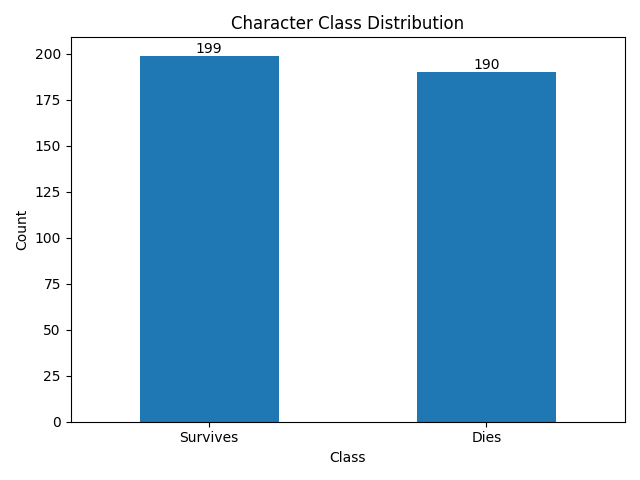
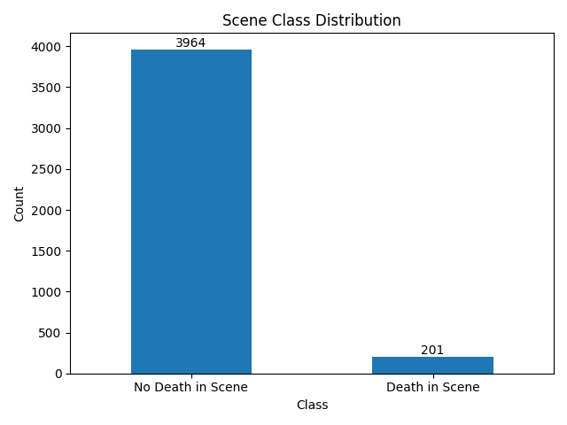
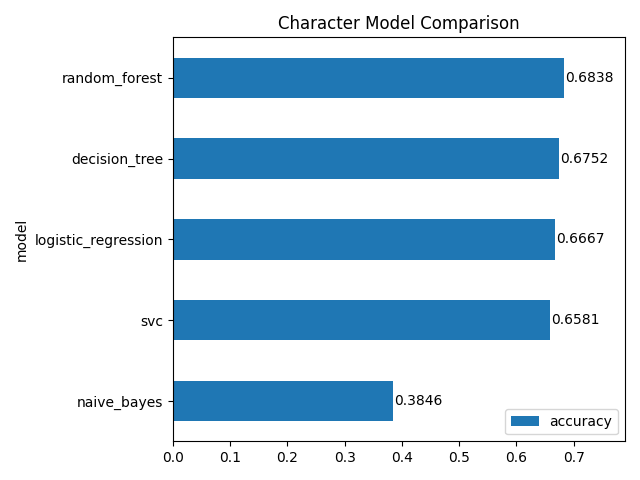
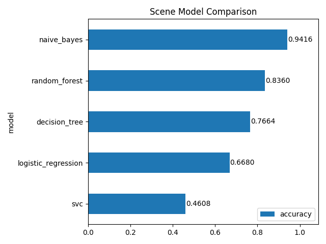
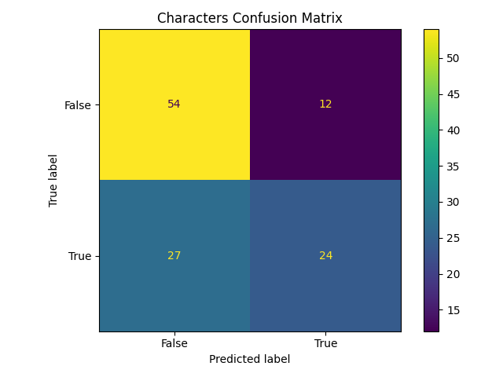
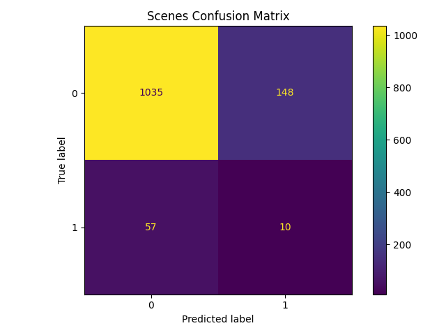
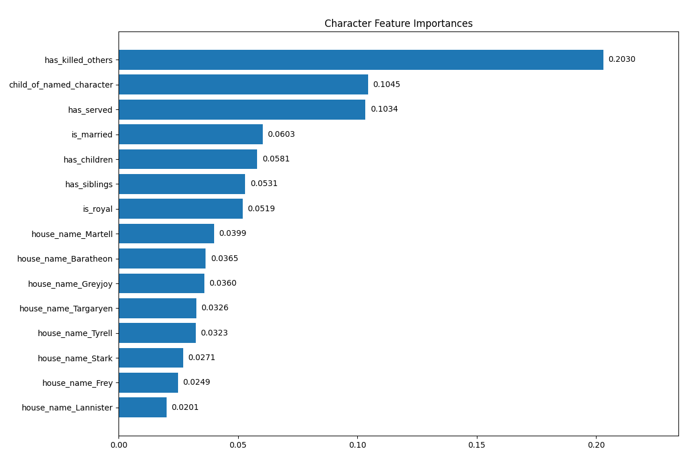
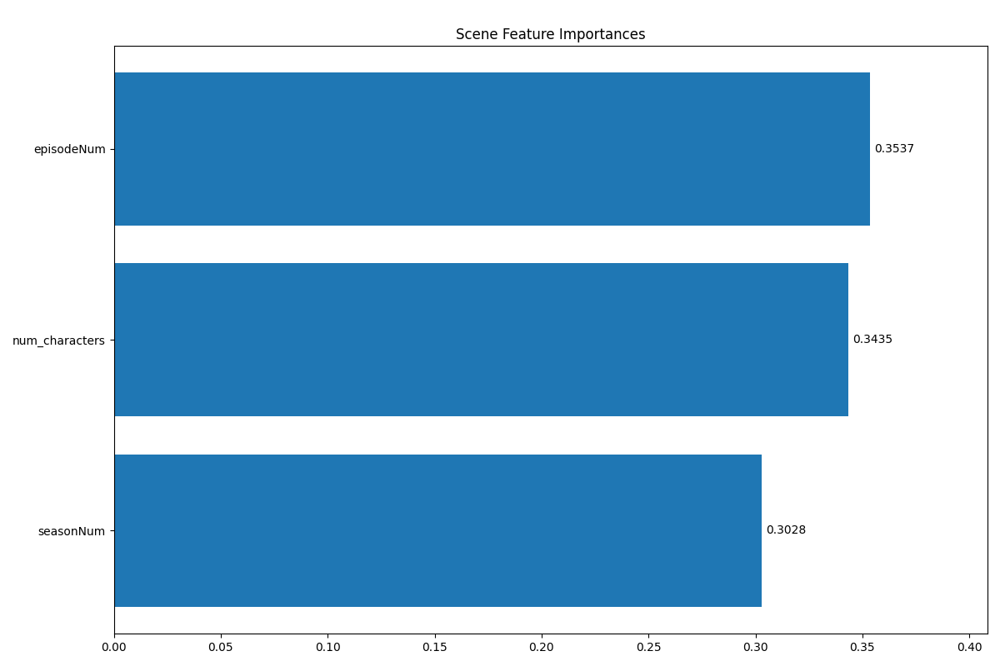
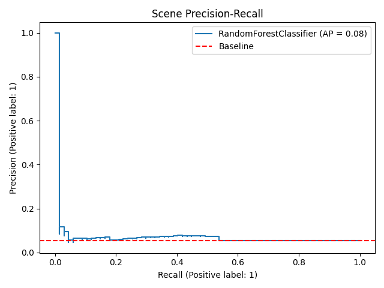

# Game of Thrones Death Prediction

Predicting character survival and scene-level deaths using machine learning on the *Game of Thrones* dataset.

---

## Project Overview

This project explores whether machine learning models can predict on-screen deaths in the HBO series *Game of Thrones*. The pipeline covers two prediction tasks:

- **Character-level modeling** — predicting whether a character is killed during the series
- **Scene-level modeling** — predicting whether a given scene contains a death

The project demonstrates **nested JSON wrangling, feature engineering, class imbalance handling, multi-model comparison, and reproducible ML pipelines**.

---

## Dataset

Source: [Jeffrey Lancaster's Game of Thrones Dataset](https://github.com/jeffreylancaster/game-of-thrones/tree/master/data)

- **episodes.json** — metadata for all 73 episodes across 8 seasons, including nested scene-level data (location, timing, characters present, death flags)
- **characters.json** — attributes for 389 characters (house, relationships, kill history, royal status, etc.)

> The raw data files are not committed to this repository. Download them from the source above and place them in the `data/` directory before running the pipeline.

---

## Data Pipeline

Raw JSON is processed by `src/data.py` into three clean Parquet files:

**Character features derived:**
- Kill history (`is_killed`, `has_killed_others`)
- Relationship flags (`is_married`, `has_children`, `has_siblings`, `child_of_named_character`)
- Role flags (`is_royal`, `is_kingsguard`, `is_guardian`, `is_guarded`, `is_served`, `has_served`)
- Identity flags (`is_young_version`, `not_human`)
- House affiliation (one-hot encoded)

**Scene features derived:**
- Scene duration (seconds)
- Number of characters present
- Flashback flag
- Location and sub-location (one-hot encoded)
- Death in scene label (derived from character `alive` status + kill metadata)
- Season and episode number

---

## Methods

### Models Compared
Five classifiers were trained and evaluated on each task:
- Decision Tree
- Random Forest
- Logistic Regression
- Support Vector Classifier (SVC)
- Naive Bayes

### Evaluation
- **Train / validation / test split** — consistent split across all models for fair comparison (random state fixed at 42)
- **Character model** — selected by weighted F1 score on validation set
- **Scene model** — selected by macro F1 score on validation set; macro averaging was chosen over weighted averaging to prevent models that ignore the minority class (deaths) from winning on the majority class alone
- **Class imbalance** — `class_weight="balanced"` applied to Decision Tree, Random Forest, SVC, and Logistic Regression for the scene model (95% of scenes contain no death)

---

## Results

### Character Survival Prediction
- **Baseline** (majority class): ~0.51 accuracy
- **Best model**: Logistic Regression — **0.667 test accuracy**
- All models significantly outperformed the baseline

### Scene Death Prediction
- **Baseline** (majority class): ~0.95 accuracy — misleading due to severe class imbalance
- **Best model**: Random Forest — **0.836 test accuracy**, macro F1 selected to penalize models that never predict deaths
- Scene death prediction is inherently difficult with structured metadata alone; the model captures some signal (episode/season number, scene size, location) but lacks narrative context that would meaningfully improve recall

### Key Insight from Feature Importance
The top three predictors of scene deaths were **episode number**, **number of characters in the scene**, and **season number** — consistent with the show's pattern of clustering deaths in later, larger-scale episodes of later seasons.

---

## Visualizations

### Class Distribution
| Characters | Scenes |
|---|---|
|  |  |

### Model Comparison
| Characters | Scenes |
|---|---|
|  |  |

### Confusion Matrices
| Characters | Scenes |
|---|---|
|  |  |

### Feature Importance (Random Forest)
| Characters | Scenes |
|---|---|
|  |  |

### Precision-Recall (Scene Model)


---

## How to Run

```bash
# Clone the repo
git clone https://github.com/timers-bouts/got-death-prediction.git
cd got-death-prediction

# Set up environment
python -m venv .venv
source .venv/bin/activate   # Windows: .venv\Scripts\activate
pip install -r requirements.txt

# Download data (see Dataset section above) and place in data/

# Run the full pipeline
make all

# Or run individual steps
make data       # build features from raw JSON
make models     # train and evaluate all models
make visualize  # generate visualizations
make clean      # remove all generated artifacts
```

---

## Project Structure

```
got-death-prediction/
├── data/                   # Raw JSON data (not committed)
├── notebooks/              # Exploratory analysis
├── reports/
│   ├── figures/            # Generated visualizations
│   └── metrics.json        # Model evaluation results
├── models/                 # Saved model artifacts (not committed)
├── src/
│   ├── data.py             # Data loading and feature engineering
│   ├── models.py           # Model training and evaluation
│   ├── visualize.py        # Visualization generation
│   └── utils.py            # Shared utilities
└── requirements.txt
```
